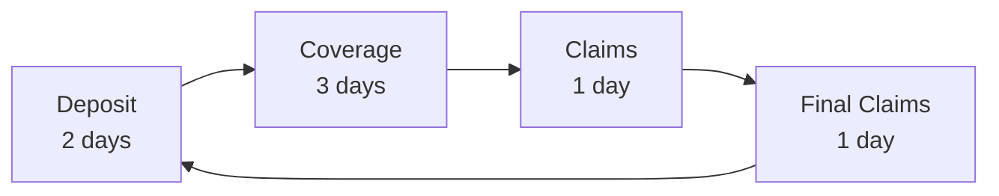

# Key Concepts

Understanding these fundamental concepts is essential for effectively using the CoverMax Protocol.

## Risk Tokenization

### What are Risk Tokens?

Risk tokens are ERC20 tokens that represent a proportional claim on the insurance pool's assets. They embody both the potential rewards (yields) and risks (claims) of providing insurance.

### Token Properties

- **Fungible**: Standard ERC20 tokens tradeable on any DEX
- **Transferable**: Can be sent to any Ethereum address
- **Composable**: Usable in other DeFi protocols
- **Redeemable**: Exchangeable for underlying assets

## Dual-Tier System

### Senior Tokens (CM-SENIOR)

<figure><figcaption><p>CM-SENIOR Token Properties</p></figcaption></figure>

- **Priority Claims**: First in line during redemption
- **Lower Risk**: Protected by junior token buffer
- **Conservative Yield**: Stable returns with downside protection
- **Use Case**: Risk-averse insurance providers

### Junior Tokens (CM-JUNIOR)

<figure><figcaption><p>CM-JUNIOR Token Properties</p></figcaption></figure>

- **Subordinate Claims**: Redeemed after senior tokens
- **Higher Risk**: First loss position in claims
- **Enhanced Yield**: Higher potential returns
- **Use Case**: Risk-seeking yield farmers

## Yield-Bearing Collateral

### Supported Assets

The protocol accepts yield-generating tokens from major lending protocols:

| Asset | Protocol | Description           | Current APY |
| ----- | -------- | --------------------- | ----------- |
| aUSDC | Aave     | Interest-bearing USDC | ~X.X%       |
| cUSDT | Compound | Interest-bearing USDT | ~X.X%       |

### Benefits of Yield-Bearing Assets

1. **Continuous Returns**: Earn yield during coverage periods
2. **Capital Efficiency**: No idle funds
3. **Compound Growth**: Yields accumulate automatically
4. **Risk Mitigation**: Yields offset potential claims

## Phase-Based Lifecycle

### Phase Timeline



### Phase Characteristics

#### 1. Deposit Phase (48 hours)

- **Actions Allowed**: Deposit assets, receive tokens
- **Trading**: Tokens immediately tradeable
- **Withdrawals**: Equal amounts only
- **Purpose**: Capital accumulation

#### 2. Coverage Phase (72 hours)

- **Actions Allowed**: Trade tokens, monitor positions
- **Claims**: Can be submitted (off-chain)
- **Withdrawals**: Equal amounts only
- **Purpose**: Active insurance period

#### 3. Claims Phase (24 hours)

- **Actions Allowed**: Senior priority redemption
- **Trading**: Continues on secondary markets
- **Emergency Mode**: Can be activated
- **Purpose**: Orderly claim settlement

#### 4. Final Claims Phase (24 hours)

- **Actions Allowed**: All tokens redeemable
- **Distribution**: Proportional to holdings
- **Cycle End**: Prepares for next cycle
- **Purpose**: Final settlement

## Risk-Return Dynamics

### Risk Spectrum

```
Lower Risk                                          Higher Risk
    ←─────────────────────────────────────────────────→
Hold Senior | Trade Senior/Junior | Hold Junior | Sell All
```

### Return Profiles

| Strategy         | Risk Level | Potential Return   | Best For               |
| ---------------- | ---------- | ------------------ | ---------------------- |
| Hold Senior Only | Low        | Stable, ~X% APY    | Conservative investors |
| Balanced Hold    | Medium     | Moderate, ~X% APY  | Diversified approach   |
| Hold Junior Only | High       | Variable, X-X% APY | Risk seekers           |
| Active Trading   | Variable   | Market-dependent   | Experienced traders    |

## Market Mechanisms

### Price Discovery

Token prices on Uniswap reflect:

- **Risk Assessment**: Market's view on claim probability
- **Yield Expectations**: Anticipated returns
- **Supply/Demand**: Trading activity and liquidity
- **Time Value**: Remaining coverage period

### Arbitrage Opportunities

1. **Tier Arbitrage**: Price discrepancies between Senior/Junior
2. **Time Arbitrage**: Value changes across phases
3. **Cross-Pool Arbitrage**: Price differences between pools

## Emergency Mechanisms

### Emergency Mode

Activated during critical events:

- **Senior Priority**: Only senior tokens can withdraw
- **Asset Selection**: Choose preferred asset for withdrawal
- **Protection**: Safeguards senior token holders

### Triggers

- Significant protocol exploit
- Major yield source failure
- Governance decision
- Owner intervention

## Value Flows

### During Normal Operations

```
Deposits → Risk Tokens → Trading → Yields → Redemption
    ↓          ↓            ↓         ↓          ↓
Vault      Uniswap     Fees      Growth    Profits
```

### During Claims Events

```
Claims Approved → Senior Redemption → Junior Redemption
       ↓               ↓                    ↓
  Validation     Priority Payout      Residual Payout
```

## Key Metrics

### Protocol Health Indicators

1. **Coverage Ratio**: Active insurance / Total deposits
2. **Liquidity Depth**: Available trading volume
3. **Risk Distribution**: Senior vs Junior holdings
4. **Yield Performance**: Actual vs expected returns

### User Metrics

1. **Position Value**: Current token worth
2. **Impermanent Loss**: For liquidity providers
3. **Risk Exposure**: Potential loss scenarios
4. **Yield Earned**: Accumulated returns

---

Continue to [Glossary](glossary.md) for definitions of technical terms used throughout the documentation.
