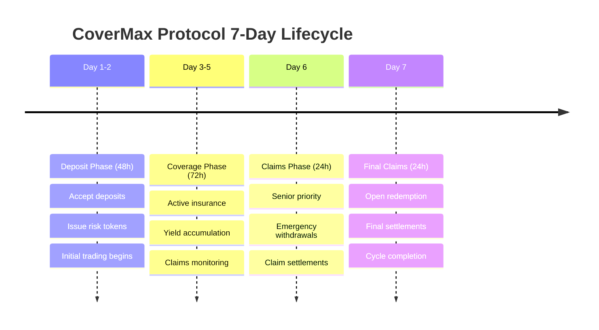

# Lifecycle Management

## Overview

CoverMax Protocol operates on a structured 7-day lifecycle that ensures orderly capital deployment, risk management, and claims processing. Understanding and managing your position throughout this lifecycle is crucial for maximizing returns and minimizing risks.

## The 7-Day Cycle

### Complete Cycle Timeline



## Phase Transition Management

### Automatic Transitions

The protocol automatically advances phases based on elapsed time:

```javascript
// Monitor phase transitions
async function trackPhaseTransitions() {
    // Current phase info
    const phaseInfo = await riskVault.getPhaseInfo();
    console.log({
        currentPhase: phaseInfo.phase,
        timeRemaining: phaseInfo.timeRemaining,
        phaseStartTime: phaseInfo.phaseStart,
        cycleStartTime: phaseInfo.cycleStart
    });
    
    // Listen for transitions
    riskVault.on('PhaseTransitioned', (fromPhase, toPhase, timestamp) => {
        console.log(`Phase changed: ${fromPhase} → ${toPhase} at ${timestamp}`);
        handlePhaseChange(toPhase);
    });
}
```

### Manual Phase Management

For testing or emergency situations, owners can force transitions:

```javascript
// Owner-only functions
await riskVault.forcePhaseTransition();          // Time-based check
await riskVault.forcePhaseTransitionImmediate(); // Immediate advance
await riskVault.startNewCycle();                 // Begin new cycle
```

## Lifecycle Strategies

### Strategy 1: Full Cycle Participation

**Approach**: Participate in entire 7-day cycle

```javascript
class FullCycleStrategy {
    async execute() {
        // Day 1-2: Deposit Phase
        await this.depositPhase();
        
        // Day 3-5: Coverage Phase
        await this.coveragePhase();
        
        // Day 6: Claims Phase
        await this.claimsPhase();
        
        // Day 7: Final Claims
        await this.finalClaimsPhase();
    }
    
    async depositPhase() {
        // Deposit maximum allocation
        const allocation = await this.calculateOptimalAllocation();
        await riskVault.depositAsset(AUSDC_ADDRESS, allocation);
        
        // Set up position monitoring
        await this.initializeMonitoring();
    }
    
    async coveragePhase() {
        // Monitor for risks
        const riskEvents = await this.scanForRisks();
        
        // Adjust position if needed
        if (riskEvents.length > 0) {
            await this.adjustPosition(riskEvents);
        }
        
        // Track yield accumulation
        await this.trackYields();
    }
    
    async claimsPhase() {
        // Evaluate claim status
        const claimStatus = await this.evaluateClaims();
        
        if (claimStatus.severity === 'high') {
            // Use senior priority
            await this.priorityWithdrawal();
        } else {
            // Wait for final phase
            await this.prepareForFinalClaims();
        }
    }
    
    async finalClaimsPhase() {
        // Complete withdrawal
        await this.finalWithdrawal();
        
        // Analyze performance
        const results = await this.analyzePerformance();
        
        // Prepare for next cycle
        await this.planNextCycle(results);
    }
}
```

### Strategy 2: Phase-Specific Entry/Exit

**Approach**: Enter and exit at optimal phases

```javascript
class PhaseOptimizedStrategy {
    constructor() {
        this.entryPhases = [0]; // Deposit only
        this.exitPhases = [2, 3]; // Claims phases
    }
    
    async monitorAndExecute() {
        riskVault.on('PhaseTransitioned', async (from, to) => {
            if (this.entryPhases.includes(to)) {
                await this.enterPosition();
            } else if (this.exitPhases.includes(to)) {
                await this.exitPosition();
            }
        });
    }
    
    async enterPosition() {
        // Wait for optimal entry timing
        const timeInPhase = await this.getTimeInPhase();
        
        // Enter near phase end for immediate trading
        if (timeInPhase > 36 * 3600) { // Last 12 hours
            await this.deposit();
        }
    }
    
    async exitPosition() {
        const phase = await riskVault.currentPhase();
        
        if (phase === 2) { // Claims phase
            // Use senior priority if available
            await this.seniorPriorityExit();
        } else { // Final claims
            // Complete exit
            await this.fullExit();
        }
    }
}
```

### Strategy 3: Rolling Participation

**Approach**: Continuously roll positions across cycles

```javascript
class RollingStrategy {
    async initialize() {
        // Set up automatic rolling
        this.autoRoll = true;
        this.rollPercentage = 80; // Roll 80% to next cycle
        
        // Monitor cycle completion
        riskVault.on('CycleStarted', async (cycleNumber) => {
            if (this.autoRoll) {
                await this.rollPosition();
            }
        });
    }
    
    async rollPosition() {
        // Calculate proceeds from previous cycle
        const proceeds = await this.calculateProceeds();
        
        // Take profits
        const profits = proceeds.mul(100 - this.rollPercentage).div(100);
        await this.withdrawProfits(profits);
        
        // Roll remainder to new cycle
        const rollAmount = proceeds.mul(this.rollPercentage).div(100);
        await this.depositForNewCycle(rollAmount);
    }
}
```

## Phase-Specific Actions

### Deposit Phase Management

```javascript
class DepositPhaseManager {
    async optimizeDeposit() {
        // 1. Check market conditions
        const marketConditions = await this.analyzeMarket();
        
        // 2. Determine deposit timing
        if (marketConditions.volatility > HIGH_VOLATILITY) {
            // Wait for calmer markets
            await this.waitForStability();
        }
        
        // 3. Choose deposit asset
        const optimalAsset = await this.selectOptimalAsset();
        
        // 4. Execute deposit
        await this.executeDeposit(optimalAsset);
        
        // 5. Initial position adjustment
        await this.adjustInitialPosition();
    }
    
    async adjustInitialPosition() {
        // Immediately trade if needed
        const targetRatio = await this.calculateTargetRatio();
        await this.rebalanceToTarget(targetRatio);
    }
}
```

### Coverage Phase Management

```javascript
class CoveragePhaseManager {
    async monitorAndManage() {
        // Continuous monitoring loop
        while (await this.isInCoveragePhase()) {
            // 1. Monitor protocol health
            const health = await this.checkProtocolHealth();
            
            // 2. Track yield performance
            const yields = await this.trackYields();
            
            // 3. Assess risk levels
            const risks = await this.assessRisks();
            
            // 4. Make adjustments
            if (risks.level > RISK_THRESHOLD) {
                await this.reduceExposure();
            }
            
            // 5. Update strategy
            await this.updateStrategy(health, yields, risks);
            
            // Wait before next check
            await sleep(3600000); // 1 hour
        }
    }
}
```

### Claims Phase Management

```javascript
class ClaimsPhaseManager {
    async executeClaimsStrategy() {
        // 1. Assess claim impact
        const claimImpact = await this.assessClaimImpact();
        
        // 2. Determine withdrawal strategy
        if (claimImpact.severity === 'high') {
            // Immediate senior withdrawal
            await this.emergencySeniorWithdrawal();
        } else if (claimImpact.severity === 'medium') {
            // Partial withdrawal
            await this.partialWithdrawal();
        } else {
            // Hold for final phase
            await this.prepareForFinalPhase();
        }
        
        // 3. Monitor junior token markets
        await this.monitorJuniorMarkets();
    }
}
```

## Timing Optimization

### Optimal Action Windows

```javascript
const OPTIMAL_TIMINGS = {
    deposit: {
        earlyBird: [0, 12], // First 12 hours - best prices
        standard: [12, 36], // Next 24 hours - normal
        lastMinute: [36, 48] // Final 12 hours - rushed
    },
    trading: {
        lowVolatility: [24, 48], // End of deposit phase
        priceDiscovery: [48, 72], // Early coverage
        riskPricing: [96, 120] // Mid coverage
    },
    withdrawal: {
        seniorPriority: [120, 144], // Claims phase
        finalSweep: [144, 168] // Final claims
    }
};

async function getOptimalActionTime(action) {
    const currentPhase = await riskVault.currentPhase();
    const timeInPhase = await getTimeInPhase();
    const cycleTime = await getTimeInCycle();
    
    return OPTIMAL_TIMINGS[action][currentPhase];
}
```

### Transaction Timing

```javascript
// Optimize transaction timing for gas and slippage
async function optimizeTransactionTiming() {
    const gasPrice = await provider.getGasPrice();
    const poolLiquidity = await getPoolLiquidity();
    
    // Best times: Low gas + high liquidity
    const score = calculateTimingScore(gasPrice, poolLiquidity);
    
    if (score > GOOD_TIMING_THRESHOLD) {
        return true; // Execute now
    }
    
    return false; // Wait for better timing
}
```

## Cycle Performance Tracking

### Metrics Collection

```javascript
class CycleMetrics {
    constructor() {
        this.deposits = [];
        this.withdrawals = [];
        this.trades = [];
        this.yields = [];
    }
    
    async trackCycle() {
        const cycleStart = await riskVault.cycleStartTime();
        
        return {
            deposited: this.calculateTotalDeposited(),
            withdrawn: this.calculateTotalWithdrawn(),
            yieldEarned: this.calculateYieldEarned(),
            tradingPnL: this.calculateTradingPnL(),
            gasSpent: this.calculateGasSpent(),
            netReturn: this.calculateNetReturn(),
            apr: this.calculateAPR()
        };
    }
}
```

### Performance Analysis

```javascript
// Analyze cycle performance for improvements
async function analyzeCyclePerformance(cycleData) {
    const analysis = {
        // Timing analysis
        depositTiming: analyzeDepositTiming(cycleData.deposits),
        withdrawalTiming: analyzeWithdrawalTiming(cycleData.withdrawals),
        
        // Risk analysis
        riskExposure: calculateAverageRiskExposure(cycleData),
        maxDrawdown: calculateMaxDrawdown(cycleData),
        
        // Return analysis
        totalReturn: cycleData.netReturn,
        returnSources: breakdownReturnSources(cycleData),
        
        // Optimization suggestions
        improvements: generateImprovements(cycleData)
    };
    
    return analysis;
}
```

## Multi-Cycle Planning

### Long-Term Strategy

```javascript
class MultiCycleStrategy {
    constructor(config) {
        this.cycleCount = config.cycles; // e.g., 12 cycles
        this.compounding = config.compound; // Reinvest profits
        this.riskAdjustment = config.riskAdjust; // Adapt to conditions
    }
    
    async executeLongTermPlan() {
        for (let i = 0; i < this.cycleCount; i++) {
            // Adjust strategy based on history
            const strategy = await this.adaptStrategy(i);
            
            // Execute cycle
            const results = await this.executeCycle(strategy);
            
            // Compound if configured
            if (this.compounding) {
                await this.reinvestProfits(results.profits);
            }
            
            // Learn and improve
            await this.updateModel(results);
        }
    }
}
```

## Emergency Lifecycle Management

### Handling Disruptions

```javascript
async function handleLifecycleDisruption(event) {
    const currentPhase = await riskVault.currentPhase();
    
    switch (event.type) {
        case 'EMERGENCY_MODE':
            if (currentPhase === 2) { // Claims phase
                await executeSeniorPriorityExit();
            }
            break;
            
        case 'PHASE_EXTENSION':
            // Adjust strategy for extended phase
            await recalibrateStrategy(event.newDuration);
            break;
            
        case 'CYCLE_PAUSE':
            // Prepare for unusual conditions
            await enterDefensiveMode();
            break;
    }
}
```

## Best Practices

### Throughout the Lifecycle

1. **Monitor Continuously**: Set up alerts for phase changes
2. **Plan Ahead**: Have strategies for each phase ready
3. **Stay Flexible**: Adapt to changing conditions
4. **Track Performance**: Measure results for improvement
5. **Manage Risk**: Adjust exposure based on phase

### Common Mistakes to Avoid

1. **Missing Deposit Window**: Set reminders for deposit phase
2. **Ignoring Phase Changes**: Automate monitoring
3. **Poor Timing**: Consider gas and liquidity
4. **Overtrading**: Each trade has costs
5. **Neglecting Claims**: Monitor for emergency modes

---

Continue to [Uniswap Integration](../integration/uniswap-integration.md) to learn about trading risk tokens on decentralized exchanges.