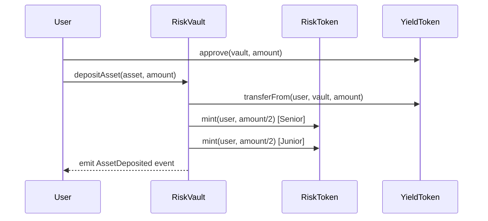
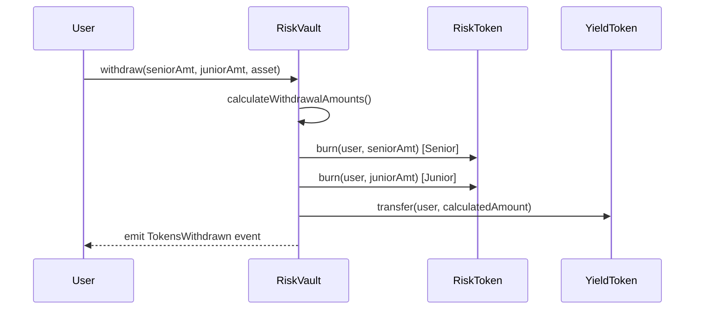

# Architecture

## System Overview

CoverMax Protocol is built on a modular architecture that separates concerns between vault management, token issuance, and market operations.

<figure><figcaption><p>CoverMax Protocol Architecture</p></figcaption></figure>

## Core Components

### 1. RiskVault Contract

The central hub of the protocol that manages:

* **Asset Custody**: Holds all deposited yield-bearing tokens
* **Token Operations**: Minting and burning of risk tokens
* **Phase Management**: Automated lifecycle transitions
* **Withdrawal Logic**: Proportional and emergency redemptions

```solidity
contract RiskVault is Ownable, ReentrancyGuard {
    // Core state variables
    address public immutable seniorToken;
    address public immutable juniorToken;
    address public immutable aUSDC;
    address public immutable cUSDT;
    
    // Lifecycle management
    Phase public currentPhase;
    uint256 public phaseStartTime;
    uint256 public cycleStartTime;
}
```

### 2. RiskToken Contracts

ERC20 implementations for tradeable risk tokens:

* **CM-SENIOR**: Priority claim tokens
* **CM-JUNIOR**: Subordinate claim tokens

```solidity
contract RiskToken is ERC20, Ownable {
    // Vault-controlled minting
    function mint(address recipient, uint256 amount) external onlyOwner
    
    // Vault-controlled burning
    function burn(address holder, uint256 amount) external onlyOwner
}
```

### 3. External Integrations

#### Yield Protocols
* **Aave**: Supplies aUSDC for lending yield
* **Compound**: Supplies cUSDT for lending yield

#### Trading Infrastructure
* **Uniswap V3**: Primary trading venue for risk tokens
* **Price Oracles**: Market price feeds (future integration)

## Contract Interactions

### Deposit Flow



### Withdrawal Flow



## State Management

### Phase Transitions

The protocol automatically transitions through phases based on time:

```solidity
enum Phase {
    DEPOSIT,      // 0: Accept deposits (2 days)
    COVERAGE,     // 1: Active insurance (3 days)
    CLAIMS,       // 2: Senior priority (1 day)
    FINAL_CLAIMS  // 3: Open redemption (1 day)
}
```

### Balance Tracking

```solidity
// Vault state
uint256 public aUSDCBalance;    // Total aUSDC in vault
uint256 public cUSDTBalance;    // Total cUSDT in vault
uint256 public totalTokensIssued; // Total risk tokens outstanding
```

## Security Architecture

### Access Control

1. **Ownership Model**
   - RiskVault owns RiskToken contracts
   - Only vault can mint/burn tokens
   - Owner can trigger emergency functions

2. **Modifiers**
   ```solidity
   modifier whenNotEmergency()
   modifier onlyDuringPhase(Phase requiredPhase)
   modifier onlyDuringPhases(Phase phase1, Phase phase2)
   ```

### Protection Mechanisms

1. **Reentrancy Guards**: All external functions protected
2. **Integer Overflow**: Solidity 0.8+ automatic checks
3. **Input Validation**: Comprehensive parameter checking
4. **Emergency Pause**: Owner-controlled circuit breaker

## Data Structures

### Core Events

```solidity
event AssetDeposited(
    address indexed depositor,
    address indexed asset,
    uint256 amount,
    uint256 tokensIssued
);

event TokensWithdrawn(
    address indexed withdrawer,
    uint256 seniorAmount,
    uint256 juniorAmount,
    uint256 aUSDCAmount,
    uint256 cUSDTAmount
);

event PhaseTransitioned(
    uint8 indexed fromPhase,
    uint8 indexed toPhase,
    uint256 timestamp
);
```

### Error Handling

Custom errors for gas efficiency:

```solidity
error InsufficientDepositAmount();
error InvalidPhaseForDeposit();
error EmergencyModeActive();
error TransferOperationFailed();
```

## Scalability Considerations

### Current Design

* **Single Vault**: One vault manages all operations
* **Two Assets**: Support for aUSDC and cUSDT
* **Fixed Phases**: Hardcoded duration periods

### Future Enhancements

1. **Multi-Vault Architecture**: Separate vaults per asset/strategy
2. **Dynamic Assets**: Pluggable yield source integration
3. **Flexible Phases**: Governance-controlled durations
4. **Cross-Chain**: Bridge to other networks

## Integration Points

### For Protocols

```solidity
interface IRiskVault {
    function depositAsset(address asset, uint256 amount) external;
    function withdraw(uint256 senior, uint256 junior, address asset) external;
    function getUserTokenBalances(address user) external view returns (uint256, uint256);
}
```

### For Traders

```solidity
// Standard ERC20 interface for trading
interface IERC20 {
    function transfer(address to, uint256 amount) external returns (bool);
    function approve(address spender, uint256 amount) external returns (bool);
}
```

## Gas Optimization

### Efficient Storage

* Packed structs where possible
* Immutable variables for constants
* Minimal storage updates

### Batch Operations

* Combined mint/burn in single transaction
* Efficient event emission
* Optimized math operations

---

Continue to [Risk Tokenization](risk-tokenization.md) to understand how insurance positions become tradeable assets.