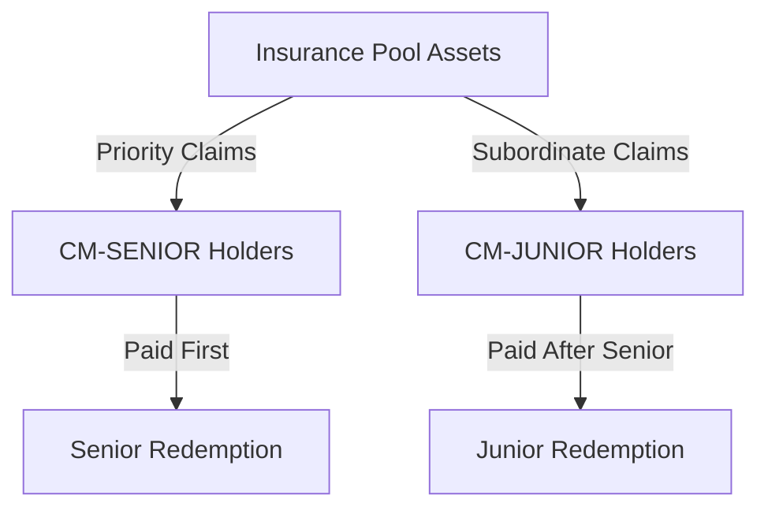

# Dual-Tier System

## Introduction

The dual-tier system is CoverMax's innovative approach to stratifying risk in decentralized insurance. By splitting each deposit into Senior and Junior tokens, the protocol creates a market for different risk appetites while maintaining capital efficiency.

## System Design

### Token Distribution

<figure><figcaption><p>Equal Distribution of Senior and Junior Tokens</p></figcaption></figure>

For every deposit:
```
Deposit Amount = X
↓
CM-SENIOR Tokens = X/2
CM-JUNIOR Tokens = X/2
```

### Risk Hierarchy



## Senior Tokens (CM-SENIOR)

### Characteristics

| Feature | Description |
|---------|-------------|
| **Risk Level** | Lower - Protected by junior buffer |
| **Claim Priority** | First in line for redemptions |
| **Target Audience** | Conservative investors |
| **Typical Premium** | Trades at premium during high risk |
| **Yield Profile** | Stable, predictable returns |

### Economic Properties

1. **Downside Protection**
   - Junior tokens absorb first losses
   - Senior maintains value until junior depleted
   - Emergency mode provides additional protection

2. **Redemption Priority**
   ```solidity
   // During claims phase, seniors redeem first
   if (currentPhase == Phase.CLAIMS) {
       // Process senior redemptions before junior
   }
   ```

3. **Market Behavior**
   - Lower volatility than junior tokens
   - Premium increases with perceived risk
   - Highly liquid due to safety preference

### Use Cases

- **Institutional Investors**: Seeking stable yields with protection
- **Risk-Averse Users**: Prioritizing capital preservation
- **Treasury Management**: Protocol treasuries avoiding volatility

## Junior Tokens (CM-JUNIOR)

### Characteristics

| Feature | Description |
|---------|-------------|
| **Risk Level** | Higher - First loss position |
| **Claim Priority** | Subordinate to senior claims |
| **Target Audience** | Yield seekers, risk traders |
| **Typical Discount** | Trades at discount during uncertainty |
| **Yield Profile** | Variable, potentially high returns |

### Economic Properties

1. **First Loss Position**
   - Absorbs initial impact of claims
   - Provides buffer for senior tokens
   - Higher risk, higher reward profile

2. **Residual Claims**
   ```solidity
   // Junior tokens claim remaining assets
   uint256 remainingAssets = totalAssets - seniorClaims;
   uint256 juniorShare = remainingAssets / totalJuniorTokens;
   ```

3. **Market Behavior**
   - Higher volatility and price swings
   - Discount widens with risk perception
   - Attractive to speculators and yield farmers

### Use Cases

- **Yield Farmers**: Maximizing returns with risk tolerance
- **Speculators**: Betting on low claim scenarios
- **Risk Traders**: Arbitraging between risk tiers

## Tier Interactions

### Trading Dynamics

#### Senior/Junior Pool on Uniswap

<figure><figcaption><p>CM-SENIOR/CM-JUNIOR Trading Pair</p></figcaption></figure>

Users can trade between tiers to adjust risk:

```
Example Trade:
Sell: 100 CM-JUNIOR
Receive: 95 CM-SENIOR
Result: Reduced risk, sacrificed 5% of value
```

### Arbitrage Opportunities

1. **Ratio Arbitrage**
   ```
   If Senior:Junior ratio > 1:1 significantly:
   - Buy undervalued junior tokens
   - Wait for ratio normalization
   - Profit from convergence
   ```

2. **Phase Arbitrage**
   ```
   During low-risk coverage phase:
   - Junior tokens trade near par
   During high-risk claims phase:
   - Junior tokens trade at discount
   ```

## Risk Scenarios

### Scenario Analysis

#### No Claims Scenario
```
Initial: 1000 tokens (500 Senior + 500 Junior)
Result: All tokens redeem at full value
Senior holders: 100% redemption
Junior holders: 100% redemption
```

#### Moderate Claims (20% loss)
```
Initial: 1000 tokens (500 Senior + 500 Junior)
Pool Loss: 200 tokens worth
Senior holders: 100% redemption (protected)
Junior holders: 60% redemption (absorb all loss)
```

#### Severe Claims (60% loss)
```
Initial: 1000 tokens (500 Senior + 500 Junior)
Pool Loss: 600 tokens worth
Senior holders: 80% redemption (partial loss)
Junior holders: 0% redemption (complete loss)
```

## Mathematical Models

### Redemption Formulas

#### Senior Token Redemption
```solidity
seniorRedemption = min(
    seniorTokens * vaultValue / totalTokens,
    seniorTokens * seniorPriority
)
```

#### Junior Token Redemption
```solidity
juniorRedemption = max(
    0,
    (vaultValue - totalSeniorClaims) * juniorTokens / totalJuniorTokens
)
```

### Price Relationships

```
Expected Relationship:
P(Senior) + P(Junior) ≈ 2 * P(Deposit)

Risk Premium:
P(Senior) = P(Deposit) + Risk Premium
P(Junior) = P(Deposit) - Risk Discount
```

## Strategic Considerations

### For Depositors

1. **Balanced Holding**: Keep both tokens for full exposure
2. **Conservative Strategy**: Sell junior, keep senior
3. **Aggressive Strategy**: Sell senior, keep junior
4. **Market Making**: Provide liquidity to tier pools

### For Traders

1. **Risk On**: Buy junior during calm periods
2. **Risk Off**: Rotate to senior during uncertainty
3. **Volatility Play**: Trade the spread between tiers
4. **Mean Reversion**: Bet on ratio normalization

## Emergency Mode Implications

### Senior Advantages

During emergency mode:
- Only senior tokens can withdraw
- Can choose preferred asset (aUSDC or cUSDT)
- Priority access to remaining funds

### Junior Limitations

During emergency mode:
- Cannot withdraw until emergency lifted
- Must wait for final claims phase
- Bear majority of protocol losses

## Future Enhancements

### Potential Improvements

1. **Dynamic Ratios**: Adjust senior/junior split based on risk
2. **Multiple Tiers**: Add mezzanine levels between senior/junior
3. **Tier Incentives**: Bonus yields for junior holders
4. **Governance Rights**: Voting power based on tier holdings

### Advanced Products

1. **Tier Indices**: Weighted baskets of both tokens
2. **Protected Products**: Guaranteed senior strategies
3. **Leveraged Junior**: Amplified junior exposure
4. **Tier Options**: Derivatives on tier ratios

---

Continue to [Supported Assets](supported-assets.md) to learn about the yield-bearing tokens accepted by the protocol.