# Protocol Phases

## Overview

CoverMax Protocol operates on a structured 7-day cycle divided into four distinct phases. This phase-based approach ensures orderly capital deployment, risk management, and claims processing while maintaining continuous market operations.

<figure><figcaption><p>CoverMax Protocol 7-Day Lifecycle</p></figcaption></figure>

## Phase Timeline

```mermaid
gantt
    title CoverMax Protocol Phases
    dateFormat  HH:mm
    axisFormat  Day %d
    
    section Cycle
    Deposit Phase (48h)     :done, deposit, 00:00, 48h
    Coverage Phase (72h)    :active, coverage, after deposit, 72h
    Claims Phase (24h)      :crit, claims, after coverage, 24h
    Final Claims (24h)      :crit, final, after claims, 24h
```



## Phase 1: Deposit Phase

### Duration: 48 hours (2 days)

### Purpose
The deposit phase allows users to contribute yield-bearing assets to the insurance pool and receive risk tokens in return.

### Allowed Actions

| Action | Permitted | Details |
|--------|-----------|---------|
| **Deposit Assets** | ✅ Yes | Deposit aUSDC or cUSDT |
| **Receive Tokens** | ✅ Yes | Get CM-SENIOR and CM-JUNIOR |
| **Trade Tokens** | ✅ Yes | Immediate Uniswap trading |
| **Withdraw** | ✅ Limited | Equal amounts only |
| **Submit Claims** | ❌ No | Not yet in coverage |

### Technical Implementation

```solidity
modifier onlyDuringPhase(Phase requiredPhase) {
    _updatePhaseIfNeeded();
    if (currentPhase != requiredPhase) {
        revert InvalidPhaseForDeposit();
    }
    _;
}

function depositAsset(address asset, uint256 amount)
    external
    onlyDuringPhase(Phase.DEPOSIT)
    whenNotEmergency
    nonReentrant
{
    // Deposit logic
}
```

### Key Characteristics

1. **Capital Accumulation**: Build insurance pool size
2. **Token Distribution**: Fair 50/50 senior/junior split
3. **Price Discovery**: Initial market pricing on Uniswap
4. **No Claims Risk**: Coverage not yet active

### Strategy Considerations

- **Early Depositors**: May get better token prices
- **Late Depositors**: Can observe pool size before committing
- **Traders**: Arbitrage opportunities as liquidity builds

## Phase 2: Coverage Phase

### Duration: 72 hours (3 days)

### Purpose
The active insurance period where the protocol provides coverage for potential claims while tokens continue trading.

### Allowed Actions

| Action | Permitted | Details |
|--------|-----------|---------|
| **Deposit Assets** | ❌ No | Deposits closed |
| **Trade Tokens** | ✅ Yes | Active secondary market |
| **Withdraw** | ✅ Limited | Equal amounts only |
| **Submit Claims** | ✅ Yes* | Off-chain process |
| **Monitor Risk** | ✅ Yes | Track protocol health |

*Claims submission happens off-chain with on-chain settlement in later phases

### Market Dynamics

During coverage phase:
- **Token prices fluctuate** based on perceived risk
- **Yield accrues** in underlying assets
- **Traders position** for potential claims
- **Liquidity deepens** on Uniswap

### Risk Events

Potential triggers during coverage:
1. Protocol exploits in Aave/Compound
2. Stablecoin depegging events
3. Smart contract vulnerabilities
4. Major market disruptions

### Strategy Considerations

- **Risk Monitoring**: Watch for adverse events
- **Trading Opportunities**: Price volatility increases
- **Hedging**: Adjust senior/junior ratios
- **Yield Farming**: Provide liquidity for fees

## Phase 3: Claims Phase

### Duration: 24 hours (1 day)

### Purpose
Priority redemption period for senior token holders, implementing the dual-tier risk structure.

### Allowed Actions

| Action | Permitted | Details |
|--------|-----------|---------|
| **Senior Redemption** | ✅ Yes | Priority access |
| **Junior Redemption** | ✅ Limited | After seniors |
| **Emergency Withdraw** | ✅ Conditional | If emergency mode |
| **Trade Tokens** | ✅ Yes | Market continues |
| **New Deposits** | ❌ No | Closed for cycle |

### Redemption Priority

```solidity
if (currentPhase == Phase.CLAIMS && emergencyMode) {
    // Only senior tokens can withdraw
    if (juniorAmount > 0) revert OnlySeniorTokensAllowed();
}
```

### Emergency Mode Features

If activated:
1. **Senior Only**: Exclusive senior withdrawals
2. **Asset Choice**: Select aUSDC or cUSDT
3. **Fast Exit**: Immediate processing
4. **Protection**: Safeguard senior holders

### Normal Operations

Without emergency:
- Both token types can withdraw
- Standard proportional distribution
- Market-based pricing continues

### Strategy Considerations

- **Senior Holders**: First claim on assets
- **Junior Holders**: Wait or trade tokens
- **Arbitrageurs**: Price discrepancies
- **Market Makers**: Provide exit liquidity

## Phase 4: Final Claims Phase

### Duration: 24 hours (1 day)

### Purpose
Complete settlement period where all remaining tokens can be redeemed and the cycle concludes.

### Allowed Actions

| Action | Permitted | Details |
|--------|-----------|---------|
| **All Redemptions** | ✅ Yes | Any token combination |
| **Final Settlement** | ✅ Yes | Proportional distribution |
| **Trade Tokens** | ✅ Yes | Last trading opportunity |
| **Cycle Reset** | ⏳ Pending | After phase ends |
| **New Deposits** | ❌ No | Wait for new cycle |

### Settlement Process

1. **Calculate Remaining Value**
   ```solidity
   uint256 remainingValue = aUSDCBalance + cUSDTBalance;
   ```

2. **Proportional Distribution**
   ```solidity
   uint256 userShare = (userTokens * remainingValue) / totalTokensIssued;
   ```

3. **Final Redemption**
   - All tokens treated equally
   - No more priority claims
   - Clear remaining positions

### Cycle Completion

After 24 hours:
- Phase automatically ends
- Owner can start new cycle
- Fresh deposit phase begins
- New 7-day cycle initiated

## Phase Transitions

### Automatic Transitions

```solidity
function _updatePhaseIfNeeded() internal {
    uint256 timeElapsed = block.timestamp - phaseStartTime;
    
    if (currentPhase == Phase.DEPOSIT && timeElapsed >= DEPOSIT_PHASE_DURATION) {
        currentPhase = Phase.COVERAGE;
        phaseStartTime = block.timestamp;
        emit PhaseTransitioned(uint8(oldPhase), uint8(currentPhase), block.timestamp);
    }
    // ... other transitions
}
```

### Manual Controls

Owner functions for emergency:
- `forcePhaseTransition()`: Trigger time-based transition
- `forcePhaseTransitionImmediate()`: Skip to next phase
- `startNewCycle()`: Begin new 7-day cycle

## Phase Information

### Query Current Phase

```solidity
function getPhaseInfo() external view returns (
    uint8 phase,
    uint256 phaseStart,
    uint256 cycleStart,
    uint256 timeRemaining
)
```

### Phase Constants

```solidity
uint256 private constant DEPOSIT_PHASE_DURATION = 2 days;
uint256 private constant COVERAGE_PHASE_DURATION = 3 days;
uint256 private constant SENIOR_CLAIMS_DURATION = 1 days;
uint256 private constant FINAL_CLAIMS_DURATION = 1 days;
```

## Strategic Timeline

### For Insurance Providers

1. **Day 1-2**: Deposit and receive tokens
2. **Day 3-5**: Monitor coverage, trade if needed
3. **Day 6**: Assess claims, position for redemption
4. **Day 7**: Complete withdrawal or roll to next cycle

### For Traders

1. **Day 1-2**: Establish initial positions
2. **Day 3-5**: Active trading on risk perception
3. **Day 6**: Arbitrage senior/junior spreads
4. **Day 7**: Final exit or accumulation

### For Protocols

1. **Day 1-2**: Deploy treasury funds
2. **Day 3-5**: Coverage active for users
3. **Day 6-7**: Evaluate results and claims
4. **Next Cycle**: Adjust strategy based on outcomes

---

Continue to [Getting Started](../mechanics/getting-started.md) to learn how to participate in the CoverMax Protocol.